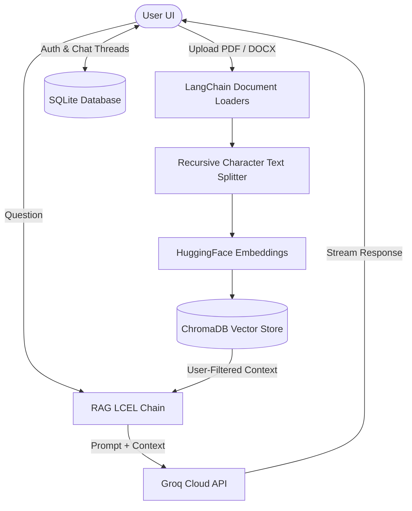

# Multi-User Private RAG AI Assistant


An enterprise-grade, privacy-focused **Retrieval-Augmented Generation (RAG)** Assistant built with **Streamlit**, **LangChain**, **Groq Cloud API**, **ChromaDB**, and **SQLite**.

Upload your PDF or Word documents and chat with an intelligent AI assistant that answers strictly based on your documents, complete with **Source Citations**, **Multi-User Authentication**, and **Persistent Multi-Chat History**.

---

## Key Features

- **Multi-User Authentication & Isolation:**
  - Secure user registration & login system with salted SHA-256 password hashing in SQLite (`app_database.db`).
  - Strict user-level document isolation: users only query their own uploaded documents.

- **Persistent Multi-Chat History:**
  - Create, switch between, and delete multiple conversation threads per user.
  - Automatic thread titling based on the user's initial question.
  - Full conversation history persistence across page refreshes.

- **Document Upload & Vectorization:**
  - Drag-and-drop PDF (`.pdf`) and Word (`.docx`) document loader.
  - Automatic character chunking (`RecursiveCharacterTextSplitter`) and local vector storage via **ChromaDB** using HuggingFace embeddings (`all-MiniLM-L6-v2`).
  - Sidebar document manager with single-click document deletion.

- **Transparent Source Citations:**
  - Interactive expander under every AI response displaying the exact source text chunks and document titles retrieved from ChromaDB.

- **High-Performance LLM:**
  - Powered by **Groq Cloud API** (`openai/gpt-oss-120b`) for sub-second inference speeds.

---

## Architecture & Workflow



---

## Repository Structure

```text
├── app.py              # Main Streamlit web application & RAG UI
├── db_manager.py       # SQLite database manager (Users, Chats, Messages, Docs)
├── requirements.txt    # Python dependencies
├── README.md           # Project documentation
├── .gitignore          # Git exclusion rules (ignores secrets & local DBs)
└── data/
    └── raw_docs/       # Directory for processed document storage
```

---

## Quick Start Guide

### 1. Prerequisites

- Python 3.10 or higher
- A free **Groq API Key** from [console.groq.com](https://console.groq.com/keys)

### 2. Installation

Clone the repository and navigate into the project folder:

```bash
git clone https://github.com/kuti-botond/docu-rag.git
cd docu-rag
```

Create and activate a virtual environment:

```bash
# Windows
python -m venv .venv
.venv\Scripts\activate

# macOS / Linux
python3 -m venv .venv
source .venv/bin/activate
```

Install the required dependencies:

```bash
pip install -r requirements.txt
```

### 3. Environment Configuration

Create a `.env` file in the root directory and add your Groq API key:

```env
GROQ_API_KEY=gsk_your_groq_api_key_here
```

### 4. Run the Application

Start the Streamlit web server:

```bash
streamlit run app.py
```

Open your browser at `http://localhost:8501`, register a user account, upload your documents, and start chatting!

---

## License

Distributed under the MIT License. See `LICENSE` for more information.
